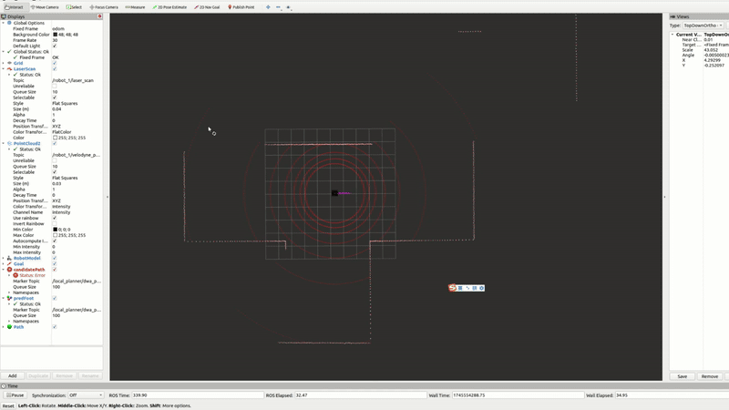
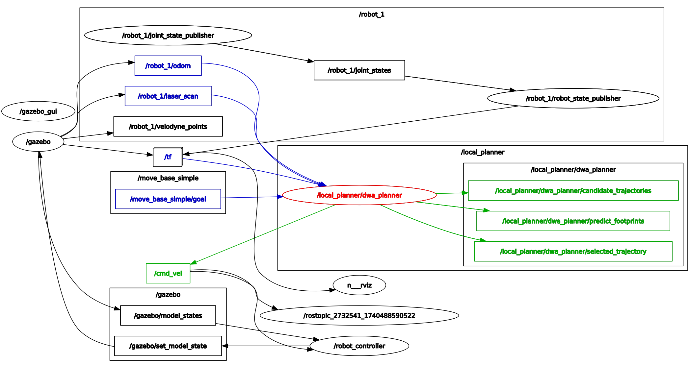

# dwa_planner with omni-directional model




## Overview

> Note in this repo, the code does not have an explicit map of the environment. If no local map is provided, the 2D laser scan will only serve as obstacle points for candidate trajectory evaluation.

> Also, dwa_planner is only a local planner. If a goal cannot be accessed by directly moving toward the goal, the robot is likely to be trapped in a local minima. If a global planner is available (which may require local or gloal map of environments), it can serve intermediate waypoints for the dwa_planner.


ROS implementation of DWA(Dynamic Window Approach) Planner

The API documentation is available at [https://amslabtech.github.io/dwa_planner/](https://amslabtech.github.io/dwa_planner/)


## Environment
- Ubuntu 20.04
- ROS Noetic

## Install and Build
```
# clone repository
cd /path/to/your/catkin_ws/src
git clone git@github.com:bairuofei/dwa_planner.git

# build
cd /path/to/your/catkin_ws
rosdep install -riy --from-paths src --rosdistro noetic # Install dependencies
catkin build dwa_planner -DCMAKE_BUILD_TYPE=Release     # Release build is recommended
```

## Usage

1. Launch a p2os_urdf package to start one-robot simulation environment;
2. Launch `roslaunch dwa_planner dwa.launch` to start dwa planner;
3. Use RVIZ to publish target point to the dwa planner.
```
# First, you should start an outside simulation environment (not provided in this repo)
roslaunch vehicle_simulator run_one.launch


# this step only launchs a node named: /local_planner/dwa_planner
roslaunch dwa_planner dwa.launch

# You can now control the robot by cliking 2D goal in RVIZ
```
The dwa_planner also needs other information from simulation environment, shown below:




## Running the demo without docker
### Using simulator
```
# clone repository
cd /path/to/your/catkin_ws/src
git clone -b noetic-devel https://github.com/ROBOTIS-GIT/turtlebot3_msgs.git
git clone -b noetic-devel https://github.com/ROBOTIS-GIT/turtlebot3.git
git clone -b noetic-devel https://github.com/ROBOTIS-GIT/turtlebot3_simulations.git

# build
cd /path/to/your/catkin_ws
rosdep install -riy --from-paths src --rosdistro noetic
catkin build -DCMAKE_BUILD_TYPE=Release

# run demo
export TURTLEBOT3_MODEL=burger
roslaunch dwa_planner demo.launch
```


## Node I/O


### Published/Subscribed Topics
Access [here](docs/Topics.md)

### Runtime requirement
- TF (from GLOBAL_FRAME to ROBOT_FRAME) is required

### demo


## Parameters
Access [here](docs/Parameters.md)

## References
- [D. Fox,  W. Burgard, and S.Thrun, "The dynamic window approach to collision avoidance", IEEE Robotics Automation Magazine, 1997.](https://ieeexplore.ieee.org/abstract/document/580977)
